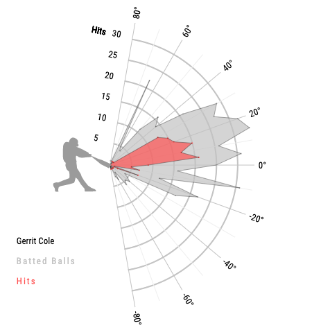
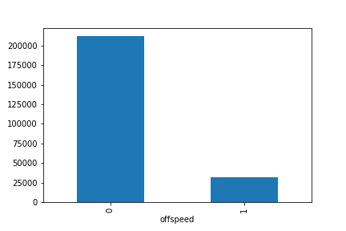

# Swing and a Miss
Predicting hard contact rate for major league baseball pitchers using Statcast datasets.



<p align="center">
  </img>
  </img>
</p>

| [Joseph Shanks](https://github.com/josephshanks) |

 
## Table of Contents

- [Basic Overview](#basic-overview)
  - [Context](#context)
  - [New Age Data](#new-age-data)
- [Exploring Data](#exploring-data)
  - [Initial Intake](#initial-intake)
  - [Import and Data Cleaning](#import-and-data-cleaning)
- [Modeling](#modeling)
  - [Visualizations](#visualizations)
- [Future Considerations](#future-considerations)
- [License](#license)


## Basic Overview

### Context


Baseball is America's past time, a game that has been played for centries and a league that was formed way back in 1869. The game was simple, use the stick, hit the ball. Besides keeping score of course, the first statistic for Major League Baseball was created in 1872, simply hits per game. Fast forward to the 1980s and baseball statistics really had not progressed much further than your basic statistics that you may be aware of, batting average, hits, home runs, total bases, ERA (earned run average) etc. Then the godfather Bill James comes along who started the 'Moneyball' era in baseball. His philosophy was rather than projecting what players might be better than others based off scours intuition, that teams should really be looking at data of players and which players get on base more often. In a nutshell, his philosophy was more people on base=more runs. Bill James philosophy was first adopted by Billy Beane and the Oakland Athletics. With James' philosophy the Athletics were able to be in the bottom 5 in total player payroll yet compete with teams like the yankees, who were almost tripple the amount of money spent towards their players. In fact in 2002, the A's had the most consecutive wins out of any team in MLB history being the first to implement this new age philosphy. The A's were expected to be one of the worst teams in baseball yet became one of the best with all odds stacked against them. That is the power of statistics.  


Being the first team to use statistical algorithms in baseball, the Athletics were able to win 103 games spending just under 400,000 dollars per win where as the Yankees spent over 1,210,000 per win. 


### New Age Data

Statcast has taken the power of statistics to a new level. In 2015 the MLB implemented tracking technology in every stadium around the league to gather previously immeasurable data from every single pitch of every single game. Some of the most impactful statistics are Exit Velocity of balls off the bat, launch angle, pitch rotation, and pitch velocity. 

> Stemming off of Bill James, I want to know if I can use machine learning models to predict what features best contribute to a pitchers success using Statcast data. To do this I want to know what features of a play contributed towards a batter having "hard contact" vs "soft contact" (greater or less than 95mph exit velocity off the bat). If a team is able to minimize the likelihood of hard contact balls throughout a game they theroretically would be able to minimize the amount of runs given up. This would allow for teams to scout for pitchers that met a specific criteria of pitching statistics to join their baseball team. 


## Exploring Data

SOURCE             | TIMEFRAME | N_RECORDS
:-------------------------:|:-------------------------:|:-------------------------:|
  | 2019 MLB SEASON |  244,393

```python
files=['data/barrell BREAKING.csv','data/barrell FAST.csv','data/barrell OFFSPEED.csv','data/flare:burner BREAKING.csv','data/flare:burner FAST.csv',
       'data/flare:burner OFFSPEED.csv','data/no contact BREAKING.csv','data/no contact FAST.csv','data/no contact OFFSPEED.csv','data/poor:top BREAKING.csv',
      'data/poor:top OFFSPEED.csv','data/poor:top FAST.csv','data/poor:under BREAKING.csv','data/poor:under OFFSPEED.csv','data/poor:under FAST.csv',
      'data/poor:weak BREAKING.csv','data/poor:weak OFFSPEED.csv','data/poor:weak FAST.csv','data/solid contact BREAKING.csv',
       'data/solid contact OFFSPEED.csv','data/solid contact FAST.csv']
```

The data I used was from the most recent baseball season (2019) Below is a preview of the format that the data comes in from the website.

<br/>


### Initial Intake

Shown below are just a few of the features that I was able to work with:
- `pitch_type`: The type of pitch derived from Statcast.
- `release_pos_x`: Horizontal Release Position of the ball measured in feet from the catcher's perspective.
- `release_pos_z`: Vertical Release Position of the ball measured in feet from the catcher's perspective.
- `zone`: Zone location of the ball when it crosses the plate from the catcher's perspective.
- `stand`: Side of the plate batter is standing.
- `p_throws`: Hand pitcher throws with.
- `balls`: Pre-pitch number of balls in count.
- `strikes`: Pre-pitch number of strikes in count.
- `pfx_x`: Horizontal movement in feet from the catcher's perspective.
- `pfx_z`: Vertical movement in feet from the catcher's perpsective.
- `plate_x`: Horizontal position of the ball when it crosses home plate from the catcher's perspective.
- `plate_z`: Vertical position of the ball when it crosses home plate from the catcher's perspective.
- `on_1b`: Pre-pitch MLB Player Id of Runner on 1B.
- `vx0`: The velocity of the pitch, in feet per second, in x-dimension, determined at y=50 feet.
- `vy0`: The velocity of the pitch, in feet per second, in y-dimension, determined at y=50 feet.
- `ax`: The acceleration of the pitch, in feet per second per second, in x-dimension, determined at y=50 feet.
- `ay`: The acceleration of the pitch, in feet per second per second, in y-dimension, determined at y=50 feet.
- `sz_top`: Top of the batter's strike zone set by the operator when the ball is halfway to the plate.
- `release_spin`: Spin rate of pitch tracked by Statcast.
- `release_extension`: Release extension of pitch in feet as tracked by Statcast.
- `if_fielding_alignment`: Infield fielding alignment at the time of the pitch.


### Import and Data Cleaning

Due to the large size of the data I used an S3 container and EC2 instead through AWS to help compute my modeling. Below is how I was able to import my 21 seperate csv files, as well as adding in columns for contact quality and the type of pitch thrown. After importing the data I created a cleaning function to run with my new data frame, here I had to drop all data that had already told me the result of the batted ball. Again, I am trying to predict how hard a ball might be hit based off pitching statistics, if I have data in my model that already captures how hard a ball is hit or if the play resulted in a out or homerun it would negatively impact my model. 

```python
def load_pitch_data_from_s3(csv_files, number_of_rows=None, bucket='qualitycontact'):
    '''
    Function to take a list of loan data CSV files that stored in an AWS S3 bucket and load and
    concatenate them into one dataframe.

    Returns:
        DataFrame: Returns a dataframe containing all loans contained within the list of CSV files.  
    '''
    datadict={}
    pitch_data = []
    for filename in csv_files:
        s3 = boto3.client('s3')
        obj = s3.get_object(Bucket=bucket, Key=filename)
        data = obj['Body'].read()
        f = BytesIO(data)
        data = pd.read_csv(f, low_memory=False, na_values='n/a', nrows=number_of_rows) 
        
        #Creating contact quality column and pitch type column
        datadict[filename]=data
        if filename in ['data/barrell BREAKING.csv','data/barrell FAST.csv','data/barrell OFFSPEED.csv','data/flare:burner BREAKING.csv','data/flare:burner FAST.csv','data/flare:burner OFFSPEED.csv', 'data/solid contact BREAKING.csv','data/solid contact OFFSPEED.csv','data/solid contact FAST.csv']:
            datadict[filename]['contact quality'] = 1
        else:
            datadict[filename]['contact quality'] = 0
            
        if filename in ['data/barrell FAST.csv','data/flare:burner FAST.csv','data/no contact FAST.csv','data/poor:top FAST.csv','data/poor:under FAST.csv','data/poor:weak FAST.csv','data/solid contact FAST.csv']:
            datadict[filename]['fast ball'] = 1
            datadict[filename]['offspeed'] = 0
            datadict[filename]['breaking'] = 0
        elif filename in ['data/barrell OFFSPEED.csv','data/flare:burner OFFSPEED.csv','data/no contact OFFSPEED.csv','data/poor:top OFFSPEED.csv','data/poor:under OFFSPEED.csv','data/poor:weak OFFSPEED.csv','data/solid contact OFFSPEED.csv']:
            datadict[filename]['fast ball'] = 0
            datadict[filename]['offspeed'] = 1
            datadict[filename]['breaking'] = 0
        else:
            datadict[filename]['fast ball'] = 0
            datadict[filename]['offspeed'] = 0
            datadict[filename]['breaking'] = 1
            
        pitch_data.append(datadict[filename])
    pitch = pd.concat(pitch_data)

    return pitch
    
    
    
def cleaning(df):
    #dropping columns that contains information of the result of the play. I am trying to model the contact quality only by factors known before the batter hits the ball
    df=df.drop(['pitch_type','game_date','player_name','pitcher','batter','events','description','spin_dir','spin_rate_deprecated','break_angle_deprecated',
         'break_length_deprecated','des','game_type','home_team','away_team','type','hit_location','bb_type','game_year','hc_x','hc_y',
         'tfs_deprecated','tfs_zulu_deprecated','umpire','sv_id','hit_distance_sc','launch_speed','launch_angle','game_pk','pitcher',
        'estimated_ba_using_speedangle','estimated_woba_using_speedangle','woba_value','woba_denom','babip_value','iso_value','pitch_name',
         'launch_speed_angle','home_score','away_score','post_away_score','post_home_score','post_bat_score','post_fld_score'],axis=1)
    
    df[['on_3b','on_2b','on_1b']] = df[['on_3b','on_2b','on_1b']].fillna(value=0)
    df[['if_fielding_alignment','of_fielding_alignment']] = df[['if_fielding_alignment','of_fielding_alignment']].fillna(value='Standard')
    df.dropna()
    
    #Was there anybody on third base?
    df['on_3b']=df['on_3b'].apply(lambda x: 1 if x >= 1 else 0)
    
    #Was there anybody on first and second base?
    df['on_2b']=df['on_2b'].apply(lambda x: 1 if x >= 1 else 0)
    df['on_1b']=df['on_1b'].apply(lambda x: 1 if x >= 1 else 0)
    
    #batter stance and pitcher stance: 1 for Right, 0 for Left
    df['stand']=df['stand'].apply(lambda x: 1 if x=='R' else 0)
    df['p_throws']=df['p_throws'].apply(lambda x: 1 if x=='R' else 0)
    df['inning_topbot']=df['inning_topbot'].apply(lambda x: 1 if x=='Bot' else 0)
    df['if_fielding_alignment']=df['if_fielding_alignment'].apply(lambda x: 0 if x=='Standard' else 1)
    df['of_fielding_alignment']=df['of_fielding_alignment'].apply(lambda x: 0 if x=='Standard' else 1)
    
    #drop nulls
    df=df.dropna()
    
    return df
```

Below is a snapshot of the new data frame.


---
## Modeling

### Logistic Regression - Random Forest - Gradient Boosting

Once running my models, I started with a great accuracy score of just around 80% using the random forest model and around .9 log loss. I thought this was great and decided to try out the gradient boosting model as well in hopes of improving my score. I didn't get much better. Originally I was pretty happy with my score until I printed out my confusion matrix...
```python
# Train and fit model                                                   
rf = RandomForestClassifier(n_estimators=10,
                           max_features='auto',
                           random_state=123)
rf.fit(X_train, y_train)
                                     
# Test Prediction
pred = rf.predict(X_test)
print(f"log loss = {log_loss(y_test, rf.predict_proba(X_test)[:, 1])}")
print(f"accuracy = {rf.score(X_test, y_test)}")
```
Random Forest Returns: log loss = 0.9092159695662608
                       accuracy = 0.8035319727000442
                       
Gradient Boosting Classifer: 

log loss = 0.4580682449284647
accuracy = 0.80858933861438


Confusion Matrix:
```python
[[48570   829]
 [11175   525]]
```       


     


My model was simply predicting just about every pitch to result in a soft contact hit/no contact hit. I believe the reason for this is due to the majority of pitches being in this category as well as the role the batter plays in solving my question. My model was not running with any form of statistic for the batter thus when a pitch is thrown to the worst batter in the league vs the best batter in the league, the model wouldn't know the difference. Additionally, through my EDA, it was very difficult to find a statistic that was highly correlated with hard contact rate or soft contact rate. 

### Visualizations

Zone Chart of all pitcher in 2019:


     



## Future Considerations

Further tuning hyperparameters using GridSearch.

Feature Engineering


## License
[MIT ©](https://choosealicense.com/licenses/mit/)
